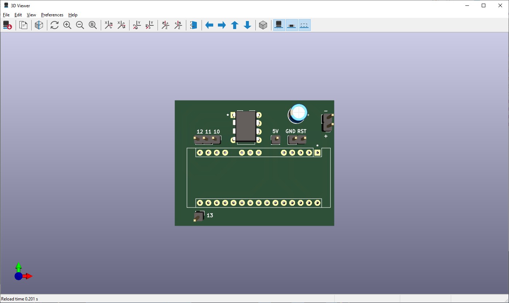
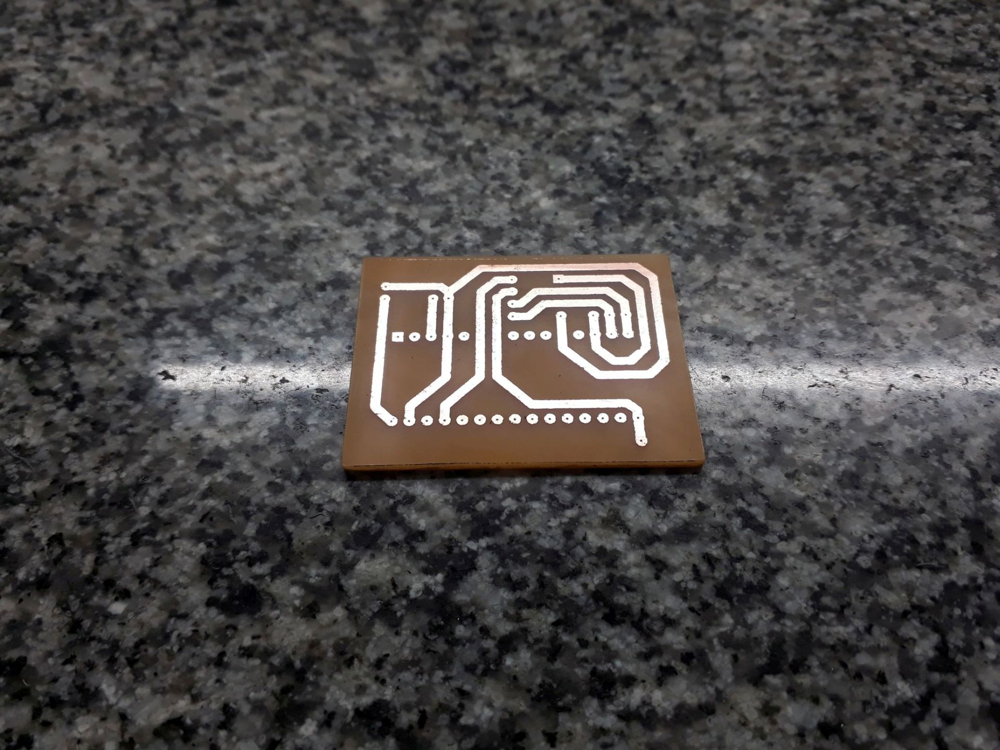
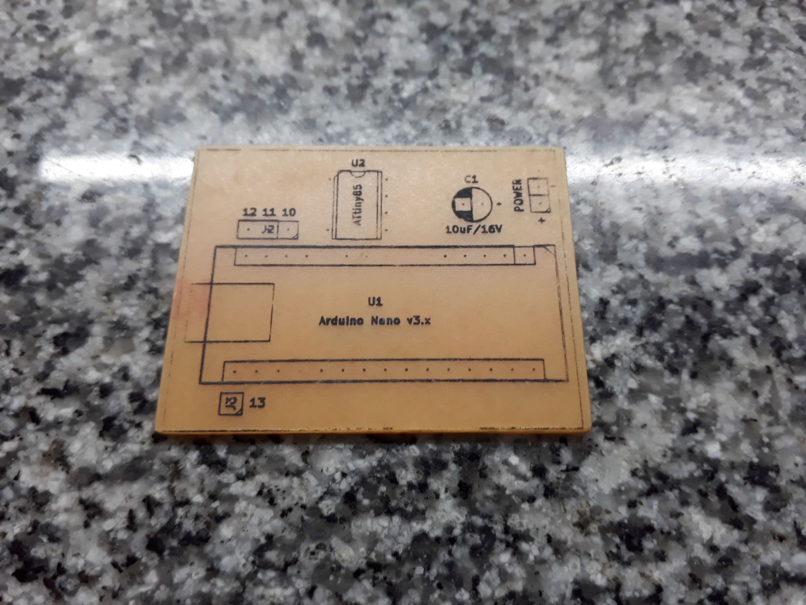

# ATtiny85 Arduino Programmer

Electronic proyect to turn an Arduino Nano/UNO into an ATtiny85 programmer.  

Based on video [CREA tu Programador DIY para ATTINY85 con Arduino UNO](https://www.youtube.com/watch?v=IFw5A_K7DOM) (spanish) from [Kriss Electronics](https://www.youtube.com/@KrissElectronics) YouTube channel.

&nbsp;

This project use the following electronic components:
- 1 x Arduino Nano v3.0 (or Arduino UNO)
- 1 x Atmel ATtiny85
- 1 x Capacitor 10uF/16V

Notes:
- PCB pin-headers 10-11-12-13 allows to program the ATtiny from an Arduino UNO instead of Arduino Nano.
- Please refer to above video, to learn about requiered Arduino IDE configuration and programming process.

&nbsp;

### Screenshots

| Diagram - Schematics                               | Diagram - PCB                                      |
|----------------------------------------------------|----------------------------------------------------|
|             |                   |

| Diagram - PCB Render                               | Diagram - PCB Render                               |
|----------------------------------------------------|----------------------------------------------------|
|         |          |

| PCB Manufacturing                                  | PCB Manufacturing                                  |
|----------------------------------------------------|----------------------------------------------------|
|          |          |

| PCB Assembly                                       | Project Assembly                                   |
|----------------------------------------------------|----------------------------------------------------|
|             |             |

| Project Final                                      | Project Final (YouTube video)                      |
|----------------------------------------------------|----------------------------------------------------|
|             |             |

See 'Rescources' sub-folder for more pictures & videos of the project.

&nbsp;

### Version History

v1.0 (2023.05.26) - Initial release.  
v1.1 (2023.05.29) - Optimizing PCB size.  
v1.2 (2023.05.31) - Fixed PCB bug.  

&nbsp;

This source code is licensed under GPL v3.0  
Please send me your feedback about this project: andres.garcia.alves@gmail.com
